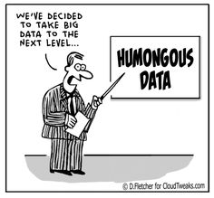
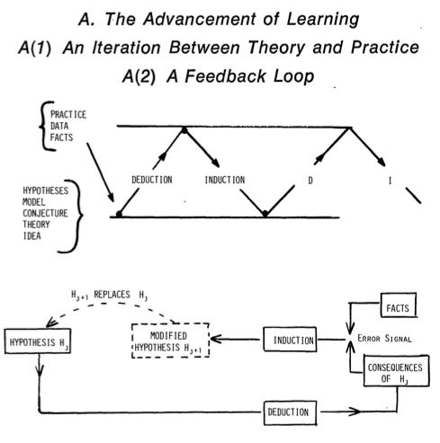
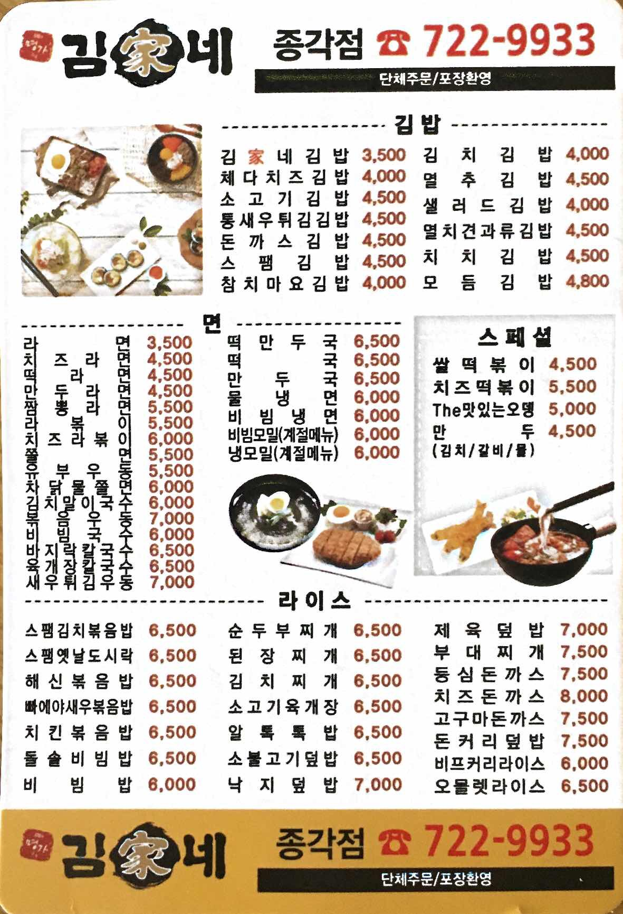

```{r setup, include=FALSE}
knitr::opts_chunk$set(echo = TRUE, fig.width=4, fig.height=4, fig.align ="center", out.width = "50%") # global options
library(ggplot2)
library(foreach)
library(knitr)
library(data.table)
library(tidyverse)
```


## Outline for today

- Introduction
- Logistics and related stuff
    - Class structure
    - Grading
- What will we learn from this class?

## Who am I?

- [Youngdeok Hwang](https://ydhwang.github.io), Assistant Professor 
- Ph.D. from University of Wisconsin--Madison (2012) in Statistics
- My research focuses on:
    * Statistical methodologies to solve real problems in industry
    * Design of experiments in modern setting
    * Applications in engineering and physical sciences

# Course logistics

## Textbook

## Where am I?

- Office: 40327 (Faculty Hall 3F)
- Office Hours:
    * Tuesday 1400-1530

## Class website [Google Classroom](https://classroom.google.com)

- Let's register together..
- Lecture notes are available online
- Install Google Classroom App on your phone; you will get push notification when a homework is posted
- Stuff written on the board will not be online; formula is easier to follow when handwritten
- The completely outdated  `icampus.ac.kr` is finally gone
- We will also use [datacamp](https://datacamp.com). Check the webpage occasionally; Homework will be posted reguarly but there will be no push or announcement.

## What do you need to take this class?

- Intellectual curiosity 
- Patience
- Knowledge of graduate level statistics -- this class is for **statistical** consulting.


## Academic integrity
- Discussion, collaboration, and research on the web are all good (and you need to learn how to do those)
- Never rely on NAVER/DAUM/Whatever Korean website search query. 
    * It is often inaccurate, insufficient, outdated, or even __wrong__.
    * Ability to search with a proper (English) question is one of the most important skill set at
    work, if not the most.

## Grading and others

- Total (100 %) = Reports (25 + 25 + 30 %) + Presentation (10 %) + Extra (10 %)
- Failure to attend to the class more than three will cause automatic F; family or medical emergency can be taken into consideration with an approval **before** the events.
- Final letter grades (no exception):
```{r, echo=FALSE, message=FALSE}
grade <- levels(cut(c(51,100), 7))
letter_grade <- c("D", "C", "C+", "B", "B+", "A", "A+")
tibble(Total = grade, Grade = letter_grade) %>% arrange(desc(Total)) %>% kable()
```


- Due to the "Anti-corruption law (김영란법)," revising the final letter grade is NOT allowed for the reasons such as: 
    - Applying for an internship
    - Eligibilities for scholarship
    - Job applications
    - ....

# Introuction

## Data are getting big

```{r, echo=FALSE, fig.align = "center", out.width = "30%"}

```


## What can we do with all these data?


There are (broadly speaking) two things you can do with data.

  1. Finding something new (EDA: exploratory data analysis)
  1. Answering a particular question (CDA: confirmatory data analysis)

## John Tukey (1962)

```{r, echo=FALSE, out.width = "20%",  fig.align = "center"}
knitr::include_graphics("../figures/John_Tukey.jpg")
```


> "Far better an approximate answer to te right question, which is often vague, than an exact answer to the wrong question, which can always be made precise."

_J. Tukey (1962), "The Future of Data Analysis," Annals of Mathematical Statistics 33 (1)_

> John Wilder Tukey, one of the most influential statisticians, a wide-ranging thinker credited with inventing the word "software."

## What is statistics?

> "Statistics is the science of learning from data, and of measuring, controlling, and communicating uncertainty."

_M. Davidian, and T. A. Louis (2012), "Why Statistics?," Science 336 (6077)_

## What is statistics?

Statistics is an area of **science** for a finding solution for a **real problem**. How?

1. Identify the problem in the domain (Science or Engineering): "Do women live longer than men in average?"
2. Boil it down to a statistical (mathematical) problem: "$H_0: \mu_M = \mu_W$ vs $H_1: \mu_M < \mu_W$"
3. Find a statistical solution to the problem: "We reject the null hypothesis and conclude that women live longer than women if the test statistic $T$ is larger than $t_{0.05, n_W+n_M-2}$".

- Your solution is justified by **mathematics**, which is why you're taking STA2014 and the whole sequence following the course. 

<!-- ```{r, echo=FALSE,  fig.align = "center", out.width = "30%"} -->
<!--  -->
<!-- ``` -->


## Science is an iterative process

```{r, echo=FALSE,  fig.align = "center"}

```

## Let's practice a small science

What are the bus lines passing by our campus? 

## What is a (modern) statistical practice?
```{r, echo=FALSE,   fig.align = "center"}
knitr::include_graphics("../figures/data-science.png")
```

## The best thing about being a statistician is that you get to play in everyone's backyard

> "The best thing about being a statistician is that you get to play in everyone's backyard." -- Tukey

- Xiao-Li Meng [Statistics: Your chance for happiness (or misery)](http://www.stat.harvard.edu/Academics/invitation_chair_txt.html)
- ... or if you're interested in more "down to earth" example, [YD Hwang](https://ydhwang.github.io).

## What is statistical consulting? 

- You are tasked with a **problem** -- it can be scientific, engineering or social science -- Then you're given a data set.  
    - Remember you're not just given a data. That's a very stupid thing to say. 
- Often, the problem is vague, not well sorted out, or even wrong -- but you're figuring this out **with** your collaborator. S/he is the expert in the domain. You're learning from him/her and s/he is learning from you. That's how we move forward together.
- This process is naturally connected to the data set you're given. 
- You will ask questions to understand the problem, and the nature of the overall study. 
- Data that you have may not be useful to answer the question -- you're working with the collaborator to formulate a better problem. Then what do we do?

## What we will learn from this class

We will learn some basic tools to do statistics like a statistician. 

- How to make yourself practice better communication.
- How to do a responsible statistical practice. 
- How to make your practice reproducible. 

## Reproducibility

```{r, echo=FALSE,  fig.align = "center", out.width = "30%"}

```

    
